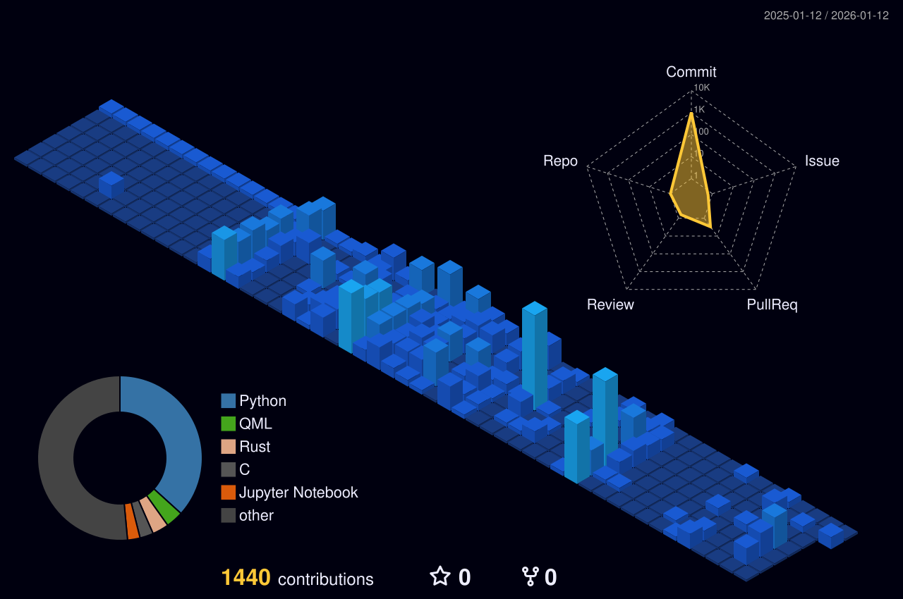

# 🧑‍💻 Huzaifa Irfan 👋

**`🤖 IoT and Automation Engineer`**

Exploring Systems, Embedded, and Web Development — building across Desktop/Web, IoT, and Automation.

<!--   <

 -->

# 🛠 Explore My Work
🚀 Click a Domain to View My Public Repositories

   
  
  
  
 <!-- 
  
  -->

   
  
  
  
  
  
 
  
 
  
  
  
  
<!--  
 
 -->

<!-- 

  
  
  
  
  
  

 -->

## 🚧 Top Work

## 🚧 Latest Work

 

## 🈸 Languages

## 💻 Tech Stack:

 

## 💾 Databases

## 📱 Platforms

### 📊 Stats

 

 

<h2 align="center">1️0️1️0️1️0️1️1️ </h2>

Last Updated on 2025-10-15
