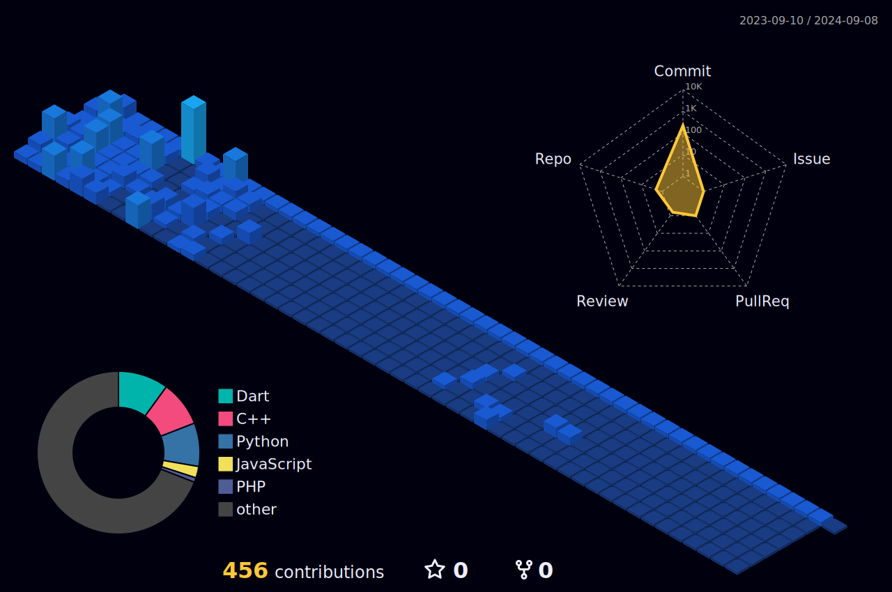

# 🧑‍💻 Huzaifa Irfan 👋

**`🤖 Robotics and Automation Engineer`**

Exploring Systems, Embedded, and Full-Stack Development — building across Desktop/Web, IoT, and Automation.

  
  
  

  
  
  
  

  
  
  
  
  
  

  
  
  
  

 

## 🈸 Languages

## 💻 Tech Stack:

 

## 💾 Databases

## 📱 Platforms

## 📐CAD

## 🚧 Top Work

### 📊 Stats

 

 

<h2 align="center">1️0️1️0️1️0️1️1️ </h2>
