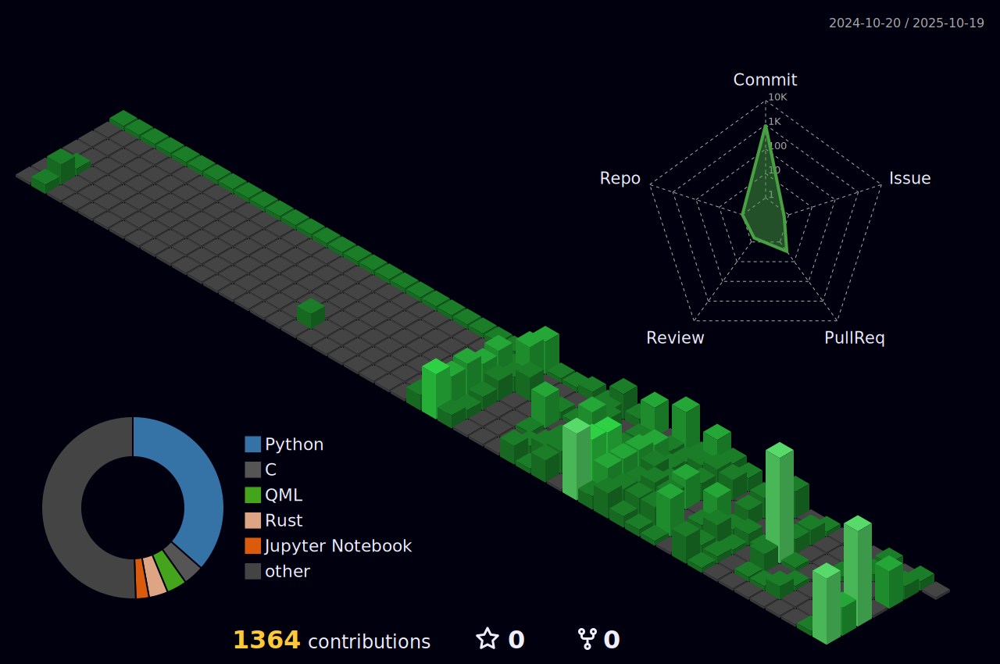

# Hi there, I'm Huzaifa Irfan 👋

  <a href="https://github.com/HuzaifaIrfan-Web" target="_blank">Web</a> | 
  <a href="https://github.com/HuzaifaIrfan-DevOps" target="_blank">DevOps</a> | 
  <a href="https://github.com/HuzaifaIrfan-AI" target="_blank">AI</a>

  <a href="https://github.com/HuzaifaIrfan-Desktop" target="_blank">Desktop</a> | 
  <a href="https://github.com/HuzaifaIrfan-Mobile" target="_blank">Mobile</a> | 
  <a href="https://github.com/HuzaifaIrfan-Systems" target="_blank">Systems</a> | 
  <a href="https://github.com/HuzaifaIrfan-Firmware" target="_blank">Firmware</a>

 
  <a href="https://github.com/HuzaifaIrfan-IoT" target="_blank">IoT</a> | 
  <a href="https://github.com/HuzaifaIrfan-Automation" target="_blank">Automation</a> | 
  <a href="https://github.com/HuzaifaIrfan-Simulations" target="_blank">Simulations</a> | 
  <a href="https://github.com/HuzaifaIrfan-Robotics" target="_blank">Robotics</a> | 
  <a href="https://github.com/HuzaifaIrfan-CAD" target="_blank">CAD</a> | 
  <a href="https://github.com/HuzaifaIrfan-Games" target="_blank">Games</a>

 
  <a href="https://github.com/HuzaifaIrfan-Infrastructure" target="_blank">Infrastructure</a> | 
  <a href="https://github.com/HuzaifaIrfan-Platform" target="_blank">Platform</a> | 
  <a href="https://github.com/HuzaifaIrfan-Security" target="_blank">Security</a> | 
  <a href="https://github.com/HuzaifaIrfan-DSA" target="_blank">DSA</a>

## 🧑‍💻 Engineer exploring Systems, Embedded, and Full-Stack development — building across Web, IoT, and Automation.

 

 

## 1️0️1️0️1️0️1️1️Everything is Open-Source, if you can read binary

